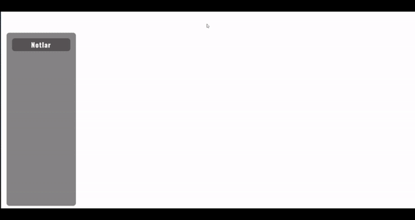

---

# Haritalı Not Ekleme Uygulaması

Bu proje, HTML, CSS, JavaScript ve Leaflet kullanarak hazırlanmış bir haritalı not ekleme uygulamasıdır. Kullanıcılar, mevcut konumlarına dayalı olarak haritada notlar ekleyebilir, bu notlara başlık, tarih ve amaç (örneğin, ev, iş, park yeri, ziyaret edilecek yerler) ekleyebilir ve uygun simgelerle işaretleyebilir.

## Özellikler

- **Kullanıcı Konumu:** Kullanıcı izni ile harita, kullanıcının mevcut konumu üzerinde açılır.
- **Not Ekleme:** Harita üzerinde herhangi bir noktayı seçerek başlık, tarih ve amaç içeren notlar ekleyebilirsiniz.
- **Amaca Göre Marker:** Notlar, amaçlarına uygun simgelerle işaretlenir.
- **Yönlendirme:** Notların üzerindeki simgelere tıklayarak işaretlenen noktaya yönlendirme yapılabilir.
- **Not Silme:** İstediğiniz zaman eklenen notları silebilirsiniz.
- **Responsive Tasarım:** Farklı cihazlara uyumlu bir arayüz.

## Ekran Görüntüleri



## Kurulum

Projeyi yerel olarak çalıştırmak için aşağıdaki adımları izleyin:

1. **Depoyu klonlayın:**
   ```bash
   git clone https://github.com/cengo14/javascript-map-notes-project.git
   ```

2. **Proje dizinine gidin:**
   ```bash
   cd javascript-map-notes-project
   ```

3. **index.html dosyasını bir tarayıcıda açın:**

   Projeyi başlatmak için `index.html` dosyasını bir tarayıcıda açın.

## Kullanım

1. Uygulama açıldığında, kullanıcıdan konum izni istenir. İzin verildiğinde harita, kullanıcının mevcut konumunda açılır.
2. Harita üzerinde not eklemek istediğiniz noktayı seçin ve açılan pencerede başlık, tarih ve amacı (ev, iş, park yeri vb.) girin.
3. Not eklenirken, amaca uygun bir marker otomatik olarak eklenir.
4. Notun üzerindeki simgelere tıklayarak işaretlenen noktaya yönlendirme yapabilirsiniz.
5. Notları silmek için notun üzerindeki "Sil" butonuna tıklayın.

## Katkıda Bulunma

Katkılarınızı memnuniyetle karşılıyoruz! Hataları bildirmeniz veya yeni özellikler önermeniz için bir **Issue** açabilir veya bir **Pull Request** gönderebilirsiniz.

## Lisans

Bu proje MIT lisansı altında lisanslanmıştır. Daha fazla bilgi için [LICENSE](LICENSE) dosyasına bakın.

---
